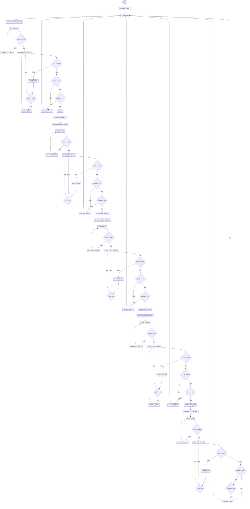

# ProjetoAssembly
Nome: Iago Rosa de Oliveira R.A.: 24.123.056-4

Nome: Mariah Santos Gomes R.A.: 24.222.027-5

## Descrição do Projeto

Neste projeto, decidimos realizar um jogo em Assembly onde o usuário possa visualizar no display uma sequência de números, que ficam um tempo no display e o usuário terá que decorar a sequência dos números e em seguida digitar a sequência utilizando comunicação serial do EdSim 51. Caso, o usuário esteja correto ele sobe de nível, ou seja, mostra um array diferente para o usuário. Portanto, o jogo terá 4 níveis diferentes, entre eles, o fácil com 4 números, o médio com 6 números, o díficil com 8 números e um GOD (super díficil) com 10 números. Caso, o usuário errar a sequência o jogo termina e ele terá que recomeçar. Mas, se o jogador ganhar, mostra uma mensagem na tela de comemoração, o jogo finaliza e volta para o início. Onde o usuário precisa digitar 1 para recomeçar o jogo. 

## Imagens da Simulação
Para iniciar o jogo o usuário precisa digitar na comunicação serial do EdSim 51 o número 1.


Após o EdSim 51 receber o número 1 mostra a tela de início do jogo e o jogo começa a rodar. 


O primeiro nível do jogo é o nível fácil com 4 números. Portanto, no jogo mostra no display qual é o nível que o usuário está jogando, e a sequência dos números. Depois de um tempo para o usuário memorizar aparece no display uma mensagem dizendo que o usuário pode digitar os números e enviar eles através do comunicador serial do EdSim 51. Além disso, se o usuário digitar menos números que o previsto do nível ou digitar mais números ele perde e o jogo reinicia.  Em particular, demostramos apenas as fotos do nível fácil, porém, esse procedimento acontece nos outros níveis da mesma forma, mas, no final do último nível mostra uma mensagem de parabéns e o jogo reinicia.


## Fluxograma

Nesse fluxograma nós só consideramos as funções de lógica do jogo. Portanto, não consideramos funções de display, funções de delay e funções vistas na aula do professor Isaac, apenas, a nossa lógica. Além disso, nesse fluxograma também não está mostrando a função de interrupção, a qual após receber os valores do usuário coloca eles no display.



## Código-fonte comentado

```javascript
;1-3 funções importantes.
;Função de interrpção, responsável em guardar os valores que o usuário digitou em um array.

;FUNÇÃO DE INTERRUPÇÃO PARA GUARDAR O QUE O USUÁRIO DIGITOU. 
org 023H
	MOV A,SBUF ; REALIZA A LEITURA DO BYTE RECEBIDO
	MOV @R0, A ; ESCREVE O VALOR NO ENDEREÇO 30H
	CLR RI ; RESETA RI PARA RECEBER NOVO BYTE
	INC R0
	INC R1
	RETI
```

```javascript
;2-3 funções importantes.
;Função para começar o jogo. Ela fica em um loop até o usuário digitar 1 (nem mais e nem menos).

USUARIO_DIGITA_START: ;FUNÇÃO PARA RECEBER O VALOR DO USUÁRIO PARA COMEÇAR O JOGO.
	MOV SCON, #50H ;porta serial no modo 1 e habilita a recepção
	MOV PCON, #80h ;set o bit SMOD 
	MOV TMOD, #20H ;CT1 no modo 2 
	MOV TH1, #243 ;valor para a recarga 
	MOV TL1, #243 ;valor para a primeira contagem
	MOV IE,#90H ; Habilita interrupção serial
	SETB TR1 ;liga o contador/temporizador 1 
	MOV R0, #50H
	MOV R1, #4FH
LOOP_START: ;LOOP QUE FICA ATIVO ATÉ O USUÁRIO DIGITAR O VALOR.
	MOV A, @R1
	CJNE A, #0Dh, RODANDO_START
	MOV R2, #0H
	MOV R3, #0H 
	MOV R1, #50H
CONT_CONT_START: ;VERIFICAÇÕES PARA SABER SE O VALOR ESTÁ CORRETO.
	MOV A, @R1
	CJNE A, #0DH, CONT_START
	CJNE R2, #1H, FALHOU_START
	CJNE R3, #0H, FALHOU_START
	RET
CONT_START: ;VERIFICANDO O VALOR (OU VALORES) QUE O USUÁRIO DIGITOU.
	MOV A, @R1
	CJNE A, #31H, ERROU_START
	INC R1
	INC R2
	JMP CONT_CONT_START
ERROU_START:
	INC R1
	INC R2
	INC R3
	JMP CONT_CONT_START
RODANDO_START:
	JMP LOOP_START
FALHOU_START: ;CASO O USUÁRIO ERRE O VALOR, ELE VOLTA PARA O LOOP INICIAL.
	JMP CONDICAO
```

```javascript
;3-3 funções importantes.
;Função para receber os valores do usuário para o nível fácil, verificar eles, e dizer se o usuário acertou ou não. Caso o usuário tenha acertado ele pula para o próximo nível, caso não, ele volta para o loop inicial.
;As funções do nível médio e difícil são iguais (com alguns valores diferentes), e o nível GOD é bem parecido, mudando que se o usuário ganhar ele também volta para o loop inicial.

USUARIO_DIGITA_FACIL: ;FUNÇÃO PARA RECEBER OS VALORES DO USUÁRIO PARA O NÍVEL FÁCIL.
	MOV SCON, #50H ;porta serial no modo 1 e habilita a recepção
	MOV PCON, #80h ;set o bit SMOD 
	MOV TMOD, #20H ;CT1 no modo 2 
	MOV TH1, #243 ;valor para a recarga 
	MOV TL1, #243 ;valor para a primeira contagem
	MOV IE,#90H ; Habilita interrupção serial
	SETB TR1 ;liga o contador/temporizador 1 
	MOV R0, #50H
	MOV R1, #4FH
LOOP_FACIL: ;LOOP QUE FICA RODANDO ATÉ TERMINAR DE RECEBER OS VALORES DO USUÁRIO.
	MOV A, @R1
	CJNE A, #0Dh, RODANDO_FACIL
	MOV R2, #0H
	MOV R3, #0H 
	MOV R0, #33H
	MOV R1, #50H
CONT_CONT_FACIL: ;CONDIÇÕES PARA VERIFICAR SE O USUÁRIO ACERTOU.
	MOV A, @R1
	CJNE A, #0DH, CONT_FACIL
	CJNE R2, #4H, FALHOU_FACIL
	CJNE R3, #0H, FALHOU_FACIL
	MOV A, #00H
	ACALL posicionaCursor
	MOV DPTR, #LIMPAR_DISPLAY
	ACALL escreveStringROM
	MOV A, #00H
	ACALL posicionaCursor
	MOV DPTR, #ACERTOU
	ACALL escreveStringROM
	MOV A, #00H
	ACALL posicionaCursor
	MOV DPTR, #LIMPAR_DISPLAY
	ACALL escreveStringROM
	MOV A, #00H
	ACALL posicionaCursor
	MOV DPTR, #PROX_NIVEL
	ACALL escreveStringROM
	MOV A, #00H
	ACALL posicionaCursor
	MOV DPTR, #LIMPAR_DISPLAY
	ACALL escreveStringROM
	RET
CONT_FACIL: ;CONFERINDO OS VALORES DO USUÁRIO COM O ARRAY.
	MOV A, @R0
	MOV B, @R1
	CJNE A, B, ERROU_FACIL
	INC R0
	INC R1
	INC R2
	JMP CONT_CONT_FACIL
ERROU_FACIL:
	INC R0
	INC R1
	INC R2
	INC R3
	JMP CONT_CONT_FACIL
RODANDO_FACIL:
	JMP LOOP_FACIL
FALHOU_FACIL: ;CASO O USUÁRIO ERRE O PROGRAMA RETORNA PARA O LOOP INICIAL.
	MOV A, #00H
	ACALL posicionaCursor
	MOV DPTR, #LIMPAR_DISPLAY
	ACALL escreveStringROM
	MOV A, #00H
	ACALL posicionaCursor
	MOV DPTR, #FALHOU_NIVEL
	ACALL escreveStringROM
	MOV A, #00H
	ACALL posicionaCursor
	MOV DPTR, #LIMPAR_DISPLAY
	ACALL escreveStringROM
	JMP CONDICAO
```
